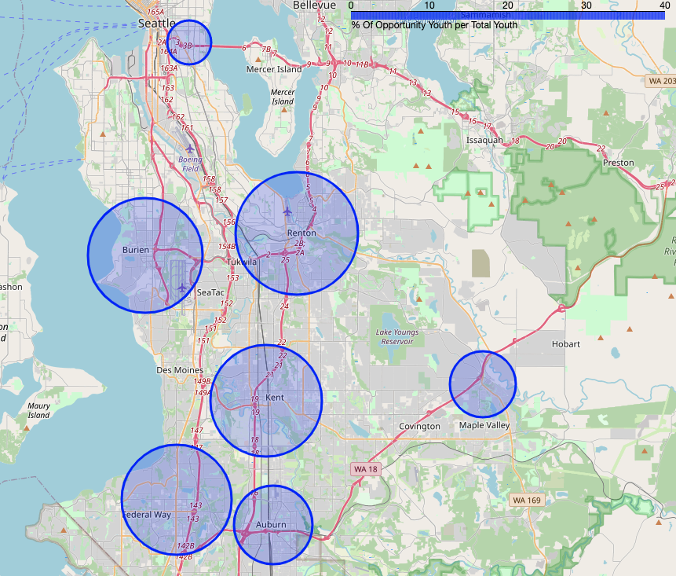
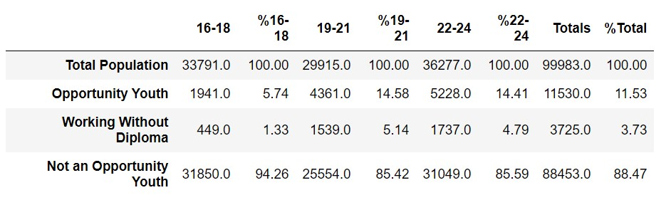
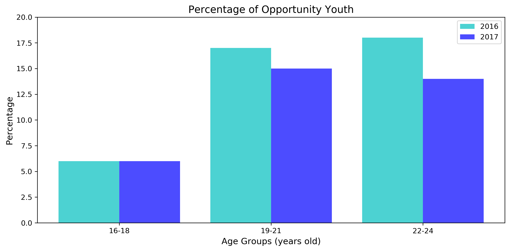
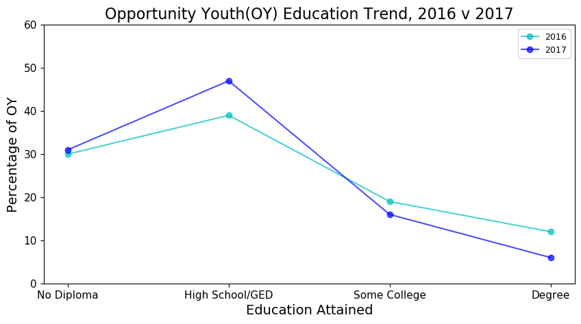

# South King County Opportunity Youth

---

This project presents an updated estimate of the number of Opportunity Youth in South King County using the 2017 5-year American Community Survey, analyzes trends between the 2016 and 2017 reports, and makes policy recommendations.

## Directory 

---

### Data Aquisition and Preparation

[Data Aquisition, Preparation, and Aggregation](notebooks/exploratory/)

[Data Query and Cleaning](notebooks/exploratory/data_preparation.ipynb)

[Data Aggregation and Exploration](notebooks/exploratory/data_aggreation.ipynb)

[2017 Data Tables](notebooks/exploratory/tables)

### Data Analysis

[Charts and Analysis](notebooks/exploratory/comparison_charts_final.ipynb)

[Charts and graphs images](/reports/figures/)

### Final Reports

[Final Report Notebook](notebooks/report/FinalNotebook.ipynb)

[Executive Summary](reports/Opportunity Youth in South King County, Group 3.pdf)

## Background
The Seattle Regional Partnership would like an update on the estimated number of OY in South King County. However, that estimation comes from a report that is over three years old. The task was to update the SRP on the current status of OY in South King County using updated data.

In the [2016 report](https://roadmapproject.org/wp-content/uploads/2018/09/Opportunity-Youth-2016-Data-Brief-v2.pdf) an opportunity youth is defined by being Age 16-24 who is not enrolled in school or having a job. From the report it was also noted that seven King County, Washington school districts: Auburn, Federal Way, Highline, Kent, Renton, (South) Seattle, and Tukwila make up for 92 % of the County’s High poverty schools. we used this information to create a table of the 2017 data for most of these regions. 

#### Regions:

Southeast Seattle and the Enumclaw region to the far southwest of the county have the lowest rates of OY youth in our study. The low OY population in SE seattle is not surprising as home values in Downtown and North Seattle neighborhoods skyrocket and employment opportunities grow in the city.  Seattle is the 3rd most gentrifying city in the U.S. 6 and many lower income people are moving south to find cheaper housing.  The Enumclaw region is very rural in nature, and borders Rainier National Forest.  However, it’s not clear how this affects employment and enrollment of youth.  The I-5 corridor hosts the greatest rates of OY in South King County, and the greatest opportunities for impactful interventions.

### Findings

---

#### Changes from 2016 to 2017

*The [2016 Road Map Project](https://roadmapproject.org/wp-content/uploads/2018/09/Opportunity-Youth-2016-Data-Brief-v2.pdf#page=4) shows the opportunity for youth to be around 18,000, because they included more of the county in their analysis. Because of this our analysis focuses on the percentages of each group compared to total population, or total OY population, rather than raw counts.*

Overall percentages of youth classified as OY fell between 2016 and 2017 among youth past high school age.  We believe this represents improving job prospects in King County due to a rapidly growing tech industry.  Even if new jobs are not in the industry itself, it attracts highly paid workers and the benefits trickle through the economy as a whole.  It also may be due to improved educational access for these age groups, but more research would be needed to confirm that.

By studying the rates of OY by educational attainment, we see more unemployed and unenrolled youth holding only a highschool diploma or GED in 2017 than 2016.  On the other hand, the rates of OY with some college or a college degree remained essentially the same or fell among all age groups.  We believe this represents greater opportunities for youth with college experience, and this is likely connected to the increase in higher skilled jobs spurred by the growing tech dependent economy.  A high school diploma just doesn’t get one as far as it used to.

We see above that more youth are out of work and school with just a high school diploma or GED in 2017 than in 2016, however a lower percentage of youth with at least some college are out of work and school.  This supports our conclusion that post-secondary education has been the key to reducing the rates of opportunity youth in these regions. 

### Conclusion

Many youth in King County face significant obstacles in becoming engages with work and/or school.  These include poverty, parenthood, physical and mental health, criminal convictions, homelessness, and past academic struggles 1.  These barriers represent policy opportunities to clear a path forward toward further education for these youth.

The trend toward jobs requiring more education leads us to recommend improving access to community colleges and trade schools.  This should come in the form of tuition waivers, childcare subsidies, transportation allowances, living and food stipends, health care, access to respectful remedial education, and targeted outreach.  With these interventions we can improve the lives of these youth and their contributions to our society and economy.

## References

1 Yohalem, N., Cooley, S. 2016. “Opportunity Youth in the Road Map Project Region”. Community Center for Education Results. Available at: https://bit.ly/2P2XRF3.

2 American Community Survey Office, 2019 “AMERICAN COMMUNITY SURVEY 2013-2017 ACS 5-YEAR PUMS FILES ReadMe”  Available at: https://bit.ly/35gFlRE.

3 King County Groundwater Protection Agency, 2020, “South King County Groundwater Management Area” kingcounty.gov

4 Balk, Gene.  2019, “New milestone in King County: Immigrant population tops 500,000”, The Seattle Times.

5 “Who Are Opportunity Youth?” 2020, The Aspen Institute Forum for Community Solutions. The Aspen Institute Forum for Community Solutions

6 Balk, Gene. 2019, “Seattle is the third most gentrifying U.S. city — but that might not be as bad as you think, study finds”, The Seattle Times.

7 Anderson, T., Braga, B., Derrick-Mills, T., Dodkowitz, A., Peters, E., Runes, C., and Winkler, M. 2019. “New Insights into the Back on Track Model’s Effects on Opportunity Youth Outcomes”. Urban Institute. Available at: https://bit.ly/2BuCLr1.

8 Seattle Region Partnership. 2016. “King County Opportunity Youth Overview: Demographics of opportunity youth and systemic barriers to employment”. Available at: https://bit.ly/2oRGz37.

9 Morton, N. 2019. “Nearly 19,000 youth in King County are neither working nor in school. How one Seattle nonprofit is changing that.” The Seattle Times. Available at: https://bit.ly/2W5EufR.
